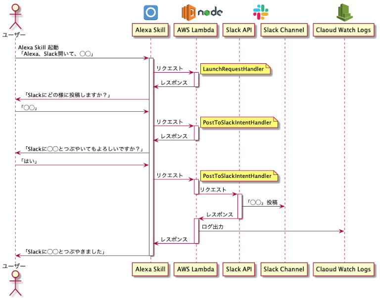

Alexaを使ってSlackへ投稿アプリ
====

[Qiita]() にも記事として投稿しています。詳細はそちらを参照ください。

<br />

# シーケンス図


<br />

# Usaga

1. SlackAPIに登録し、トークンを発行。またSlackのワークスペースよりAPI経由で投稿できるよう設定

2. Lambda関数作成後、以下の手順でローカルからソースコードをアップロード

```
$ git clone {このレポジトリ}

# クローンしたディレクトリに移動後、初期化＆必要なモジュールをインストール
$ npm install
$ npm install --save ask-sdk-core
$ npm install --save ask-sdk-model
$ npm install --save request

# 圧縮後lambdaにアップロード
$ zip -r {ファイル名} index.js node_modules
```

3. Lambda関数の環境変数として先ほど発行されたトークンや投稿したいチャンネル、slackAPIのエンドポイントなどを登録

4. 下記記事を参考にAlexaSkillのスロット、インテントを作成

「Alexa、出勤！」で快適なリモートワークを [[Qiita記事]]()

5. Lambda関数のトリガーとして、先ほど作成したAlexaSkillを登録

6. AlexaSkillのエンドポイントとして、先ほど作成したLambda関数のARNを登録

7. AlexaSkillをデプロイ（ボタン押下で簡単にできます）
